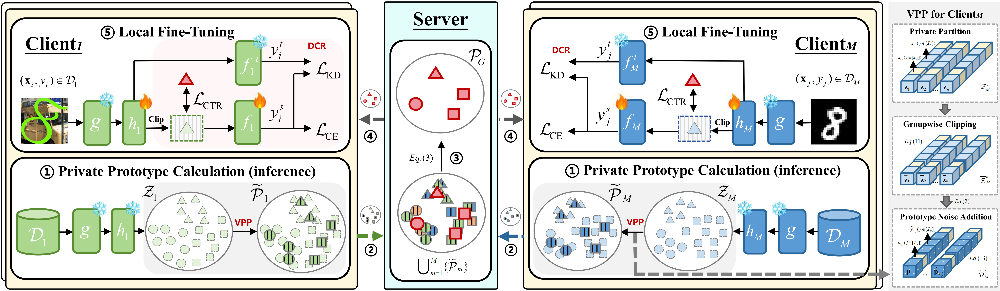

# Taming Noise-Induced Prototype Degradation for Privacy-Preserving Personalized Federated Fine-Tuning (CVPR 2026)

Official implementation of **Taming Noise-Induced Prototype Degradation for Privacy-Preserving Personalized Federated Fine-Tuning (CVPR 2026)**.

<p align="center">
  
</p>

This repository focuses on **federated prototype-based personalization (ProtoPFL)** and implements **VPDR** as a client-side plug-in that can be incorporated into existing ProtoPFL frameworks (e.g., FedProto). Compared with the classical equal-noise baseline (**IGPP**), VPDR provides a better privacy–utility trade-off by preserving more informative prototype dimensions during perturbation. The default implementation is designed for domain-skew or label-skew settings with **ResNet** and **ViT** backbones, while the framework can also be extended to other datasets and model families.

---

### VPDR Plug-in

VPDR consists of two key components:

- **Variance-adaptive Prototype Perturbation (VPP):**  
  Allocates perturbation noise adaptively across feature dimensions under the same local differential privacy guarantee, thereby reducing unnecessary information loss.

- **Distillation-guided Clipping Regularization (DCR):**  
  Introduces a distillation-guided soft clipping mechanism during local personalization to stabilize per-sample feature norms and improve robustness.

**VPDR can be integrated into a ProtoPFL pipeline through simple configuration flags such as `--noise_add vpp` and `--use_dcr`.**

### High-Level Workflow

1. Each client applies **VPP** and differential privacy perturbation to upload privatized prototypes.
2. The server aggregates local prototypes into global prototypes.
3. Each client performs **DCR-enhanced personalization** on its private local data.

--- 

## Requirements

- Python 3.8+
- PyTorch ≥ 1.10 (GPU recommended)
- torchvision
- scikit-learn (FINCH / KMeans clustering)

--- 

## Data & Model Preparation

- **Data**: Please manually download the datasets (or use the script’s automatic download option, if available) and place them under the `data/`.  
- **Pretrained models**: store the required ResNet/ViT checkpoints under `model/` (e.g., `vit-small/`, `vit-tiny/`). Any compatible weights are acceptable as long as the directory layout matches the code.

--- 

## Example Run

```bash
python main.py \
  --dataset office_caltech10 \
  --node_num 4 \
  --T 20 \
  --E 2 \
  --model_type vit_small \
  --noise_add vpp \
  --use_dcr \
  --dcr_kd_weight 0.05 \
  --device cuda:0
```

Training logs, checkpoints, and metrics are stored under `logs/{exp_name}/...`, with summaries in `metrics.json`.

--- 

## Directory Layout

```
├── main.py               # training entry point
├── options.py            # argument parser
├── client.py             # client-side prototype generation and local updates
├── server.py             # server-side prototype aggregation and updates
├── proto.py              # prototype construction, clustering, and perturbation
├── models.py             # model definitions and heterogeneous model factory
├── utils/
│   ├── init.py           # node, model, and optimizer initialization
│   ├── utils.py          # general utilities
│   ├── domain_skew.py    # domain-skew data loading
│   ├── label_skew.py     # label-skew data loading
│   ├── dp_utils.py       # differential privacy utilities
│   └── ...
└── README.md
```
 
