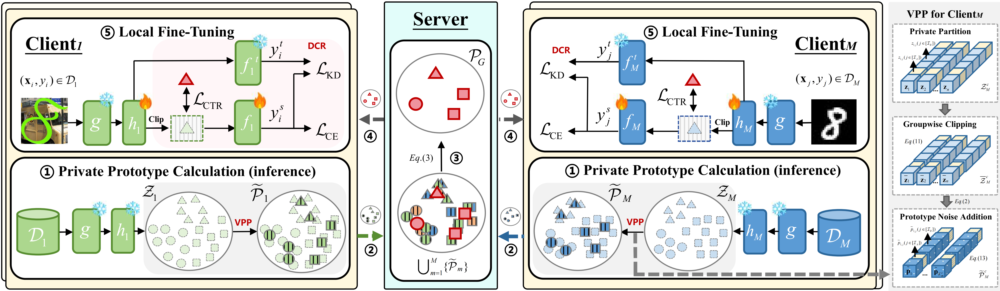

## Taming Noise-Induced Prototype Degradation for Privacy-Preserving Personalized Federated Fine-Tuning (CVPR 2026)

Official implementation of **Taming Noise-Induced Prototype Degradation for Privacy-Preserving Personalized Federated Fine-Tuning (CVPR 2026)**.

<p align="center">
  
</p>

This repository focuses on **federated prototype-based personalization (ProtoPFL)** and implements **VPDR** as a client-side plug-in that can be incorporated into existing ProtoPFL frameworks (e.g., FedProto). Compared with the classical equal-noise baseline (**IGPP**), VPDR provides a better privacy–utility trade-off by preserving more informative prototype dimensions during perturbation. The default implementation is designed for domain-skew (Office-Caltech-10, PACS, Digits) or label-skew (CIFAR-10/100) settings with **ResNet** and **ViT** backbones, and can be extended to heterogeneous model families.

---

### VPDR Plug-in

VPDR consists of two key components:

- **Variance-adaptive Prototype Perturbation (VPP):**  
  Allocates perturbation noise adaptively across feature dimensions under the same local differential privacy guarantee, thereby reducing unnecessary information loss.

- **Distillation-guided Clipping Regularization (DCR):**  
  Introduces a distillation-guided soft clipping mechanism during local personalization to stabilize per-sample feature norms and improve robustness.

**VPDR can be integrated into a ProtoPFL pipeline through simple configuration flags such as `--noise_add vpp` and `--use_dcr`.**

### High-Level Workflow

1. Each client applies **VPP** and differential privacy perturbation to upload privatized prototypes.
2. The server aggregates local prototypes into global prototypes.
3. Each client performs **DCR-enhanced personalization** on its private local data.

---

## Requirements

- Python 3.8+
- PyTorch ≥ 1.10 (GPU recommended)
- torchvision
- scikit-learn (for FINCH / KMeans if used)
- transformers (for ViT / RoBERTa backbones)

---

## Data & Model Preparation

- **Data root**: place datasets under `data/` or set `--data_root` accordingly.  
  - Domain-skew: `office_caltech10`, `pacs`, `digits` (handled by `utils/domain_skew.py`).  
  - Label-skew: `cifar10`, `cifar100` (handled by `utils/label_skew.py`, controlled by `--dirichlet_alpha`).
- **Pretrained models**: store ResNet/ViT/Roberta checkpoints under `model/`, e.g.:
  - `model/vit-tiny/`, `model/vit-small/`, `model/vit-base-patch16-224-in21k/`
  - `model/roberta_base/`

Any compatible local weights are acceptable as long as the directory layout matches the code.

---

## Example Run

Run VPDR on Office-Caltech-10 with ViT-Small backbone under domain-skew:

```bash
python main.py \
  --dataset office_caltech10 \
  --data_root ./data \
  --method fedproto \
  --node_num 4 \
  --T 20 \
  --E 2 \
  --model_type vit_small \
  --noise_add vpp \
  --epsilon 1.0 \
  --delta 1e-5 \
  --use_dcr \
  --device cuda:0
```

Training logs, checkpoints, and metrics are stored under `logs/{exp_name}/{dataset}_alpha{dirichlet_alpha}/N{node_num}_T{T}_E{E}/`, with summaries in `{method}_metrics.json`.

---

## Directory Layout 

```
├── main.py               # training entry point (data loading, DP calibration, FL loop)
├── options.py            # argument parser (data, model, DP, VPDR, attacks, etc.)
├── client.py             # client-side prototype generation, DP noise, and local updates
├── server.py             # server-side prototype aggregation / MPFT / FedTGP
├── attacks/              # prototype hijack and membership inference attacks
├── utils/
│   ├── __init__.py       # Node, model/optimizer initialization, heterogeneous models
│   ├── tools.py          # utilities (seeding, validation, DP sigma calibration, losses)
│   ├── proto.py          # prototype construction, clustering, and DP perturbation
│   ├── models.py         # backbone + adapter + head definitions and factories
│   ├── domain_skew.py    # domain-skew data loading (Office-Caltech-10, PACS, Digits)
│   └── label_skew.py     # label-skew data loading (CIFAR-10/100)
└── README.md
```

---

## Citation

If you find our work useful in your research, please consider citing:

```bibtex
@inproceedings{wang2026vpdr,
  title={Taming Noise-Induced Prototype Degradation for Privacy-Preserving Personalized Federated Fine-Tuning},
  author={Yuhua Wang, Qinnan Zhang, Xiaodong Li, Huan Zhang, Yifan Sun, Wangjie Qiu, Hainan Zhang, Yongxin Tong and Zhiming Zheng},
  booktitle={Proceedings of the IEEE/CVF Conference on Computer Vision and Pattern Recognition (CVPR)},
  year={2026}
}